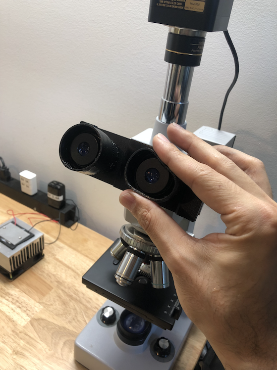

# microscopy

files for (μ)scope projects

### models

- [Eye Guard 3D model (stl)](models/ME-eyeguard.stl) for AmScope ME300TZC, and likely any other scopes with similar size eye pieces
  - or grab the [Fusion 360 file](models/ME-eyeguard.f3d)
  - printed using NinjaFlex (Water) with 0.4mm nozel on UM2+, grab my Cura [NinjaFlex 0.4mm settings](settings/ninjaflex-0.4mm.curaprofile)
  - oiled filament to help feeding through bowden tube
